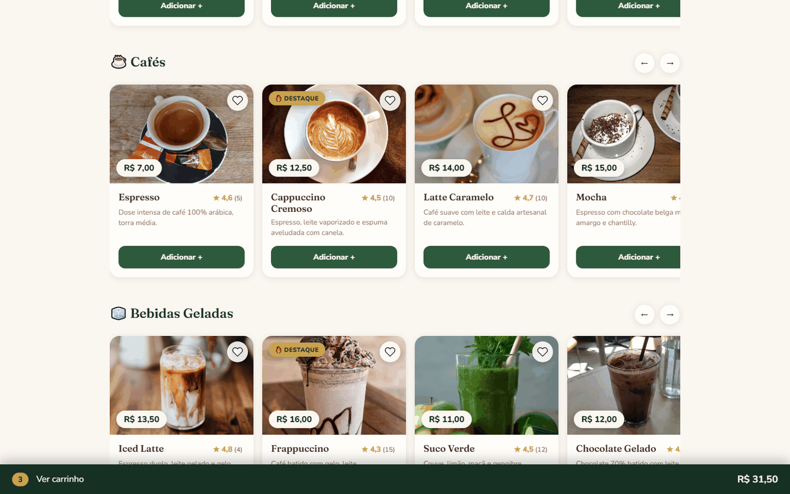
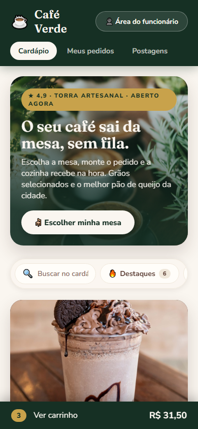
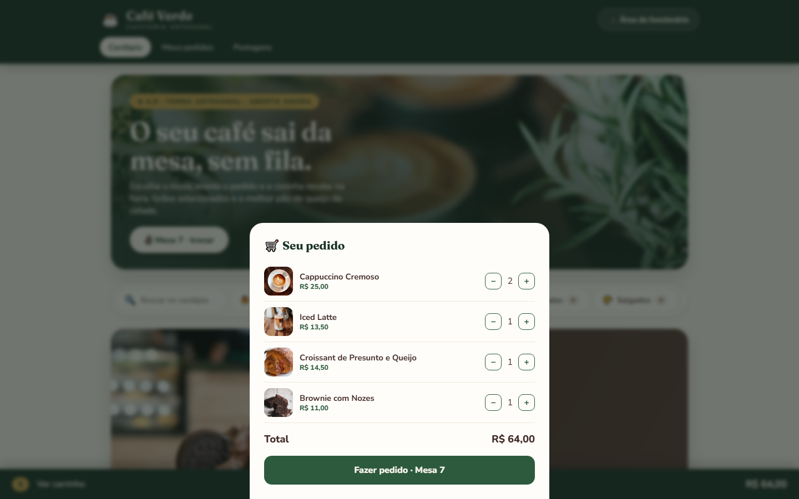
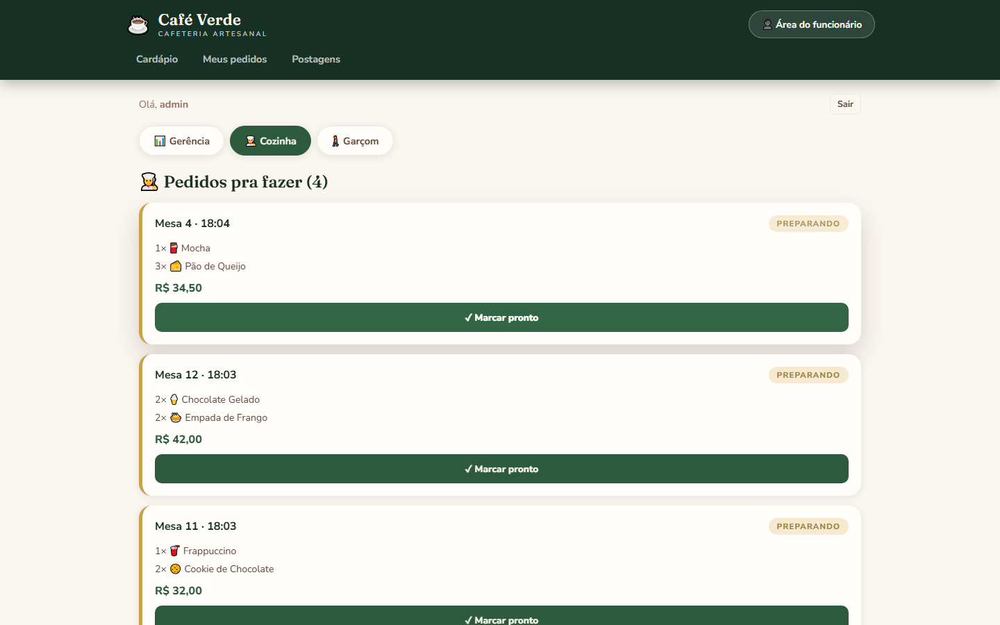
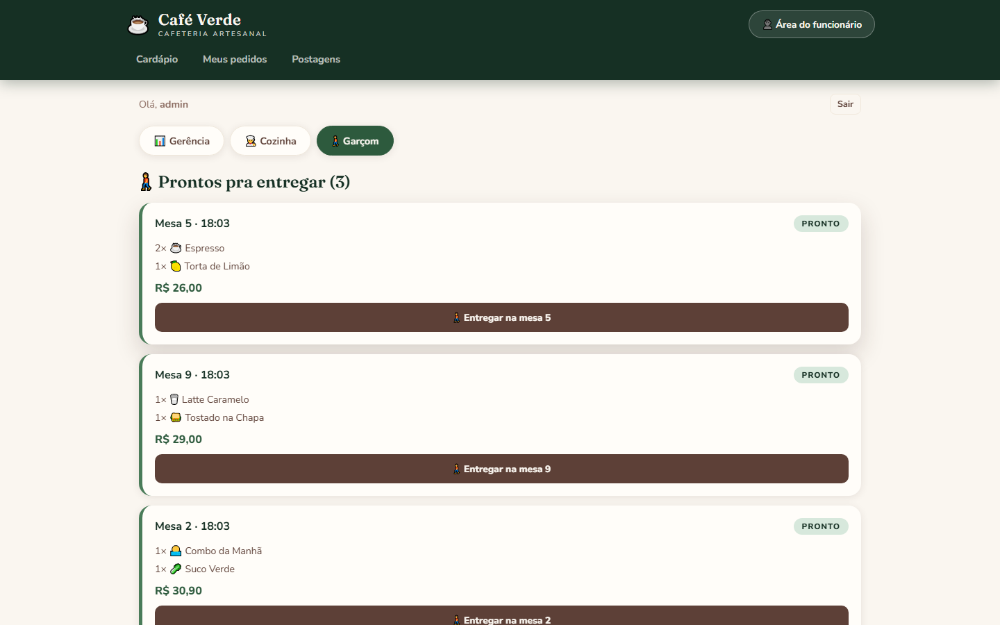

# Café Verde

Table ordering for a small café: customers order from their phones, and the kitchen and waiter screens update live over WebSockets.

The interface is in Brazilian Portuguese.

## What it does

- **Customer** (no account needed): picks a table (1 to 12), browses the menu by category with photos and accent-insensitive search, fills a cart and sends the order. The "Meus pedidos" tab shows each order's status as it changes.
- **Kitchen**: new orders appear without a page refresh; one button marks an order as ready.
- **Waiter**: sees ready orders with their table number and marks them as delivered, plus a list of what is still being prepared.
- **Manager** (`admin`): today's order count and revenue, queue counts, menu management (photo, price, featured flag, pause an item) and posts for the café's news feed.
- **Menu extras**: featured items, an "Em alta" (trending) row based on the last 7 days of sales, a product of the day, favorites saved in the browser and 1 to 5 star ratings.

Order flow: `preparando` (kitchen) -> `pronto` (waiter) -> `entregue`.

## Screenshots


Customer menu by category, with photos, ratings and the cart bar.


The same menu on a phone (390 px wide).


Cart with table 7 selected, ready to send to the kitchen.


Kitchen screen: orders arrive over WebSocket and one button marks each as ready.


Waiter screen: ready orders with their table number, followed by what is still being prepared.

## Interesting parts

- **Live updates through one Channels group.** Creating an order and changing its status both call `transmitir_pedido()` in `backend/core/views.py`, which sends the serialized order to the `pedidos` group. `PedidosConsumer` forwards it to every connected screen. The socket is read-only; all writes go through the REST API.
- **Auto-reconnecting React hook.** `frontend/src/useLive.js` opens the socket, keeps the latest callback in a ref so the connection is not recreated on every render, and reconnects 3 seconds after a drop until the component unmounts.
- **Prices are calculated on the server.** `PedidoSerializer.create()` reads each product's price from the database and stores it on the order item, so later menu changes do not rewrite old orders. The test `test_cliente_cria_pedido_e_total_vem_do_banco` sends a fake unit price of 0.01 and checks that the total is still 24.50.
- **Trending in the same query as the menu.** `ProdutoViewSet.get_queryset()` annotates each product with units sold in the last 7 days through a correlated `Subquery`, which keeps it from multiplying rows when combined with the rating `Avg` and `Count`.
- **Rate limits and security settings.** DRF scoped throttles: 10 orders/min, 10 login attempts/min and 20 ratings/min per client, 60 requests/min for other anonymous calls. Responses send `X-Content-Type-Options: nosniff` and `X-Frame-Options: DENY`; with `DEBUG=0` Django also forces HTTPS, secure cookies and HSTS. Staff log in with JWT (SimpleJWT), and `frontend/src/api.js` refreshes an expired access token once before giving up. There is no public sign-up.

## Stack

- **Backend:** Python 3.12, Django 5, Django REST Framework, SimpleJWT, Channels 4 with Daphne, channels-redis
- **Data:** PostgreSQL 16, Redis 7 (channel layer)
- **Frontend:** React 18, React Router 6, Vite 5
- **Tooling:** Docker Compose, SonarQube (optional)

## Run it locally

Requirements: Docker with Compose.

```bash
cp .env.example .env          # Windows: copy .env.example .env
# edit .env and change SECRET_KEY and the passwords
docker compose up -d --build
```

On start the backend applies migrations, runs `python manage.py seed` (20 menu items, 4 posts, initial ratings and the staff users) and serves the app with Daphne.

Optional demo data, so the trending row and the daily summary have something to show (11 more products, 3 posts, ratings and 45 orders spread over the last 7 days):

```bash
docker compose exec backend python manage.py popular
```

| URL | What |
|---|---|
| http://localhost:5173 | The app (customer side and staff area) |
| http://localhost:8000/api/ | REST API (DRF browsable API) |
| http://localhost:8000/django-admin/ | Django admin |
| ws://localhost:8000/ws/pedidos/ | Order feed (the frontend reaches it through the Vite proxy on port 5173) |
| http://localhost:9000 | SonarQube, only if started with `docker compose up -d sonarqube` (about 2 GB of RAM) |

### Demo logins

Staff sign in through "Área do funcionário" in the header. The seed creates these users with the passwords set in `.env`:

| User | Password variable | Sees |
|---|---|---|
| `admin` | `ADMIN_PASSWORD` | Manager, kitchen and waiter tabs; also a Django admin superuser |
| `cozinha` | `COZINHA_PASSWORD` | Kitchen |
| `garcom` | `GARCOM_PASSWORD` | Waiter |

The seed only creates users that do not exist yet, so changing a password in `.env` later does not update an existing user.

The source folders are mounted into the containers. Vite uses file polling so hot reload also works with Docker on Windows.

### Static analysis (optional)

```bash
docker compose up -d sonarqube
# log in at http://localhost:9000, change the default admin password,
# create a token under My Account > Security, then:
docker run --rm -e SONAR_HOST_URL=http://host.docker.internal:9000 -e SONAR_TOKEN=<your-token> -v "$(pwd):/usr/src" sonarsource/sonar-scanner-cli
```

## Tests

```bash
docker compose run --rm backend python manage.py test
```

Four API tests in `backend/core/tests.py`: server-side order total, table number validation, status change permissions (anonymous gets 401, staff can change it, invalid status gets 400) and product ratings. The tests swap the Redis channel layer for the in-memory one; the database is the Postgres container. There are no frontend tests.

## Project status

Study and demo project, not deployed. I built it to practice Django Channels, DRF and React together. Known limits: the order feed and the order detail endpoint are public by design (they only carry table, items and status), and customers find their own orders through ids saved in the browser. A real deployment would scope both to a table or session.

Built with AI coding assistants as part of my workflow.

## Credits

- Product photos from Unsplash, except the ones below, which come from Wikimedia Commons (resized, some cropped):
  - Espresso: ["Cup of espresso 02"](https://commons.wikimedia.org/wiki/File:Cup_of_espresso_02.jpg) by Kritzolina, [CC BY-SA 4.0](https://creativecommons.org/licenses/by-sa/4.0/)
  - Latte Caramelo: ["Vegan Caramel Latte (5221801524)"](https://commons.wikimedia.org/wiki/File:Vegan_Caramel_Latte_%285221801524%29.jpg) by Jennifer from Vancouver, Canada, [CC BY 2.0](https://creativecommons.org/licenses/by/2.0/)
  - Mocha: ["Mocha (4355110522)"](https://commons.wikimedia.org/wiki/File:Mocha_%284355110522%29.jpg) by Karen and Brad Emerson, [CC BY 2.0](https://creativecommons.org/licenses/by/2.0/)
  - Café Coado da Casa: ["Café coado"](https://commons.wikimedia.org/wiki/File:Caf%C3%A9_coado.jpg) by Melsj, [CC BY-SA 4.0](https://creativecommons.org/licenses/by-sa/4.0/)
  - Chocolate Gelado: ["Iced Chocolate - T @ Hove 2023-09-07"](https://commons.wikimedia.org/wiki/File:Iced_Chocolate_-_T_@_Hove_2023-09-07.jpg) by Andy Li, [CC0 1.0](https://creativecommons.org/publicdomain/zero/1.0/)
  - Pão de Queijo: ["Cheesebread"](https://commons.wikimedia.org/wiki/File:Cheesebread.jpg) by Murilo Manzini, [CC BY-SA 4.0](https://creativecommons.org/licenses/by-sa/4.0/)
  - Croissant de Presunto e Queijo: ["Ham and cheese croissant 1119159785"](https://commons.wikimedia.org/wiki/File:Ham_and_cheese_croissant_1119159785.jpg) by Charles Haynes, [CC BY-SA 2.0](https://creativecommons.org/licenses/by-sa/2.0/)
  - Empada de Frango: ["Empadas de frango Vila Isabel Rio de Janeiro Brasil"](https://commons.wikimedia.org/wiki/File:Empadas_de_frango_Vila_Isabel_Rio_de_Janeiro_Brasil.jpg) by Eduardo P, [CC BY-SA 3.0](https://creativecommons.org/licenses/by-sa/3.0/)
  - Bolo de Cenoura: ["Bolo de Cenoura, 08-12-2020"](https://commons.wikimedia.org/wiki/File:Bolo_de_Cenoura,_08-12-2020.jpg) by Pedro Toniazzo Terres, [CC BY-SA 4.0](https://creativecommons.org/licenses/by-sa/4.0/)
  - Combo da Manhã: ["Pao de queijo com cafe"](https://commons.wikimedia.org/wiki/File:Pao_de_queijo_com_cafe.jpg) by nwerneck, [CC BY 3.0](https://creativecommons.org/licenses/by/3.0/)
  - Combo da Tarde: ["Carrot cake, Eppstein"](https://commons.wikimedia.org/wiki/File:Carrot_cake,_Eppstein.jpg) by Gerda Arendt, [CC BY-SA 4.0](https://creativecommons.org/licenses/by-sa/4.0/)
  - Combo Duplo: ["Coffee Caramel Croissant, Nutella Cookie, Flat White, Latte - Bee May Bakery 2026-09-29"](https://commons.wikimedia.org/wiki/File:Coffee_Caramel_Croissant,_Nutella_Cookie,_Flat_White,_Latte_-_Bee_May_Bakery_2026-09-29.jpg) by Andy Li, [CC0 1.0](https://creativecommons.org/publicdomain/zero/1.0/)
- Fonts: Fraunces and Nunito Sans, from Google Fonts.

## Versão em português

Café Verde é um sistema de pedidos por mesa para cafeteria: o cliente pede pelo celular e as telas da cozinha e do garçom atualizam em tempo real via WebSocket (Django Channels + Redis).
A seção "Em alta" é calculada no banco a partir das vendas dos últimos 7 dias, e o preço de cada pedido é sempre calculado no servidor.
Para rodar: copie `.env.example` para `.env`, troque as senhas e execute `docker compose up -d --build`; o site abre em http://localhost:5173.
É um projeto de estudo, sem deploy em produção.
